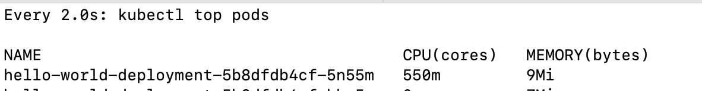

# How to Generate Traffic to Test the Load on a Kubernetes App

This guide walks you through deploying a simple app on Kubernetes, generating traffic with k6, and monitoring resource usage to observe the impact of load.
This is specific for testing apps locally, they can be tested within the cluster by installing k6 in the same kube cluster

---

## 🚦 Pre-requisites

- Access to a **Kubernetes cluster** with `kubectl` configured
- **metrics-server** installed and running on the cluster (required for `kubectl top pods`)
- [k6](https://k6.io) installed locally (see below)

---

## 1️⃣ Install k6 on macOS
```brew install k6```

```k6 version``` To check k6 is installed successfully

## 2️⃣ Deploy the Hello-World App
```kubectl apply -f kube-test-app/app.yaml```

### Check pod status
``` kubectl get pods```

## 3️⃣ Port-Forward the Service

Expose the service to your local machine:

``` kubectl port-forward service/hello-world-service 8080:80```

## 4️⃣ Run k6 to Generate Traffic
```k6 run --vus 50 --duration 1m script.js``` 

This simulate 50 users for 1 minute, feel free to change users and minute's value

## 5️⃣ Monitor Pod CPU and Memory Usage
```watch kubectl top pods```

This will show CPU and memory consumption for each pod.  
If you see increased values during the k6 test, your app is handling traffic as expected. Refer the below image and yuo can see cpu utilisation increased.


